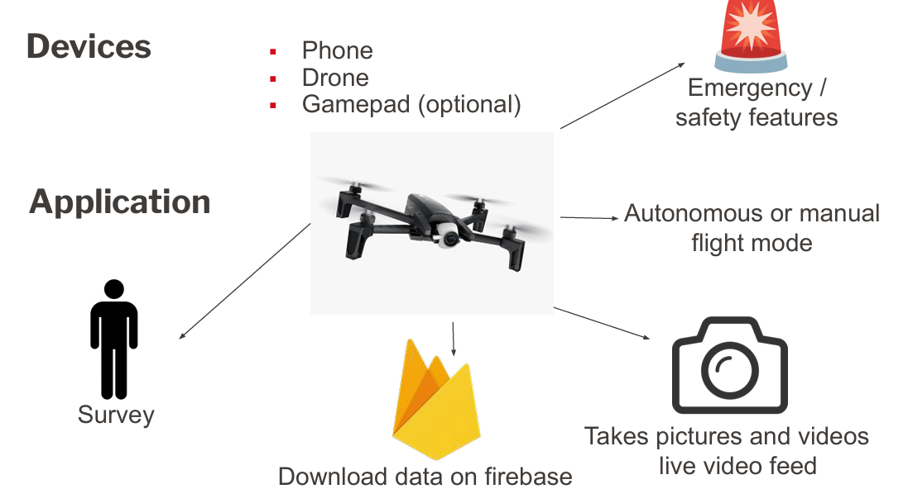
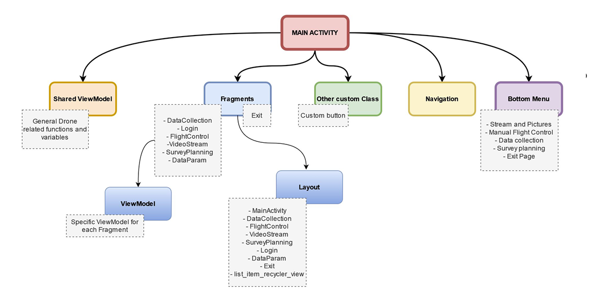
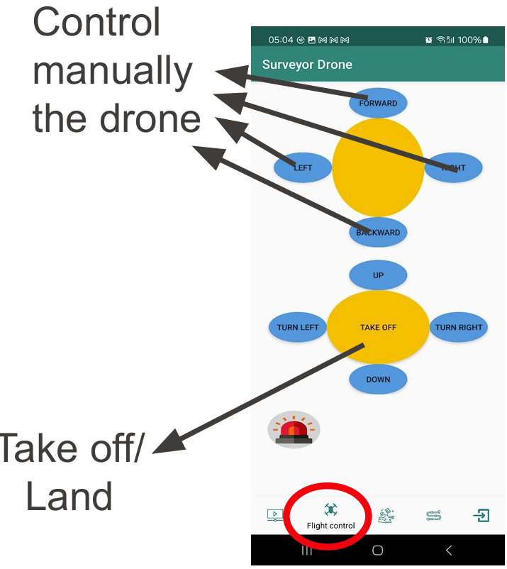
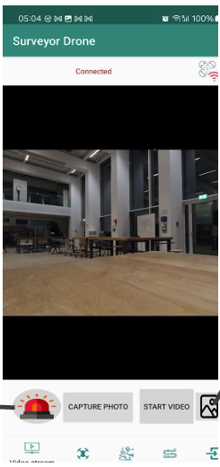
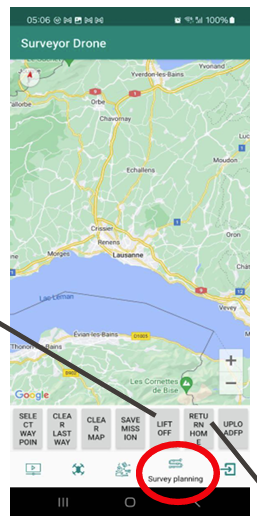
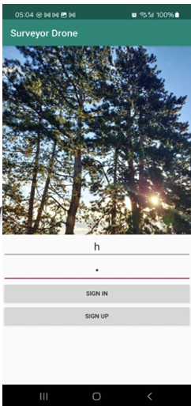

# Surveyor Drone – Mobile UAV Control & Data Acquisition System

This project implements a mobile application for controlling a drone in both **manual and autonomous flight modes**, with integrated **live video streaming**, **data collection**, and **cloud synchronization**.

Developed at EPFL, the project focuses on **system integration**: mobile UI, wireless communication, and real-time drone control.

---

## Overview

The system consists of:

- Mobile application (Android)
- Drone platform
- Optional gamepad interface

Core functionalities:
- Live video streaming
- Manual and autonomous flight control
- Waypoint-based mission planning
- Photo/video capture
- Cloud data storage (Firebase)
- Emergency/safety features

### System Overview



---

## Architecture

The application follows a modular Android architecture:

- **MainActivity**: central orchestration
- **Fragments**:
  - Data collection
  - Flight control
  - Video stream
  - Survey planning
- **ViewModels**: logic separation
- **Shared ViewModel**: global drone state



---

## Key Features

### Flight Control
- Manual piloting interface
- Autonomous waypoint navigation
- Takeoff / landing controls
- Emergency stop



---

### Video & Data Handling
- Live video stream from drone
- Remote capture (photo/video)
- Media storage and retrieval
- Firebase integration



---

### Mission Planning
- Map-based waypoint placement
- Survey execution workflow




---

### User Interface
- Login / Signup system
- Modular navigation (bottom menu)
- Multiple control modes



---

## Technical Stack

- Android (Java / Kotlin)
- Firebase (backend & storage)
- Drone SDK / communication interface
- Wireless communication (OFDM-based link context)

---

## How to Build

### Requirements

- Android Studio (latest stable recommended)
- Android SDK installed
- Android device or emulator

### Steps

```bash
git clone https://github.com/<your-username>/surveyor-drone.git
cd surveyor-drone
```

1. Open the project in Android Studio  
2. Let Gradle sync  
3. Build the project (`Build → Make Project`)  
4. Run on device or emulator (`Run → Run 'app'`)

### Notes

- A physical device is recommended (camera + connectivity)
- Some features require a real drone connection

---

## What Works

- UI navigation (login, menus, screens)
- Manual control interface (command generation)
- Video streaming interface (UI side)
- Firebase integration (basic data upload/download)
- Mission planning interface (waypoints)

---

## Current Limitations

- Real drone connection requires specific hardware setup
- Autonomous flight partially implemented
- Network reliability affects streaming and control
- Limited error handling for connection loss
- Manual control accuracy can be improved

---

## Engineering Challenges

- Simultaneous connection to drone and internet
- Real-time control and streaming constraints
- Multiple control modes (manual / autonomous / emergency)
- Reliability under unstable communication

---

## Possible Improvements

- Improve control precision and responsiveness
- More robust data synchronization
- Better fault tolerance (connection loss)
- Cleaner Firebase integration

---

## Project Structure

```text
/app
  /ui
  /viewmodel
  /navigation
  /data
/drone_interface
/firebase
/docs
  /images
```

---

## Documentation

Full presentation available at:

```text
docs/presentation.pdf
```

---

## Authors

- Charlotte Heibig
- Ariane Priou

EPFL – 2024
